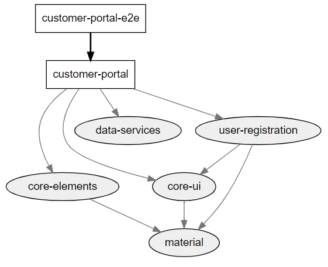

# NgMasterClass

This project was generated with [Angular CLI](https://github.com/angular/angular-cli) using [Nrwl Nx](https://nrwl.io/nx).

## Objective

This is a reference implementation for building enterprise applications using Angular CLI and Nx extensions.

### Nx Extensions extends the Angular CLI project generation to provide a mono-repo for the application

#### Technologies Used

- Angular 7
- Nx Extensions
- Angular Material
- NGRX for State Management
- Dog CEO APIs for dog images and lists
- NGX Logging for uniform logging / server side logging

#### Patterns

- Nx Extensions Mono Repo - Faster deliveries , parrallel development , consistency , sharing
- Observable Page Guards
- Fake Backend intercepters for Authentication
- Error Interceptor across the application for better UX - cross cutting concern
- JWT Interceptor across the application - cross cutting concern
- NGRX / Redux Pattern - Actions, Action Types, Reducers , App State , Effects , Selectors
- Dynamic Angular Element implementation - for user comments (on clicking on info button)
- Image Preloader (UX)
- API / Service Classes
- Global Alert / Snackbar Service
- Feature / Presentation Components
- Atomic Design Patterns
- Material UI Design
- Page transition animation
- Externalized Configuration

### Use Case

- This application simulates a pet shop
- The list of breeds and sub breeds are aviable in the search box
- The user can select from the available breeds and see the same photographs
- The user needs to login before he can proceed with the shopping experience. If not logged in the user is prompted to login during this journey
- Valid user name and password is admin/admin
- One puppy per breed can be added to the cart

#### The steps include

- Add puppies to the cart (one per breed/sub-breed). Mulitple puppies of different breeds can be added to the cart
- Add shipping/customer registration details
- View/Modify final order
- Purchase
- Continue Shopping

### Live Demo

- Demo is available [here](https://trusting-morse-326429.netlify.com)

### Recorded


### Project Structure

- customer-portal-e2e - Customer Portal e2e tests
- customer-portal - Main App / Feature components / State management
- data-services - Data API Services
- material - angular material module and configuration
- core-ui - core UI components / stateless presentation / layout components / pipes / services / feature module
- user-registration - user registration ui feature module
- core-elements - core UI custom elements module



#### Miscellaneous

Nx is an open source toolkit for enterprise Angular applications.

Quick reference commands

```
ng g app customer-portal --routing - Creating App
ng generate lib core-ui --publishable
ng g service fake-backend-interceptor --project=data-services
ng g lib core-ui --routing --parent-module=apps/customer-portal/src/app/app.module.ts
ng g lib core-ui --routing --lazy --parent-module=apps/customer-portal/src/app/app.module.ts
ng generate component login --project=core-ui -m --export
```

Add custom elements

```
ng g lib core-elements --publishable
ng add @angular/elements
ng g c button --inline-style --inline-template -vNative --project core-elements -m --export
```

Nx is designed to help you create and build enterprise grade Angular applications. It provides an opinionated approach to application project structure and patterns.

Copying assets from [multiple projects](https://github.com/angular/angular-cli/blob/master/docs/documentation/stories/asset-configuration.md#project-assets) and [this](https://github.com/nrwl/nx/issues/88)

## Quick Start & Documentation

[Watch a 5-minute video on how to get started with Nx.](http://nrwl.io/nx)

## Generate your first application

Run `ng generate app myapp` to generate an application. When using Nx, you can create multiple applications and libraries in the same CLI workspace. Read more [here](http://nrwl.io/nx).

## Development server

Run `ng serve --project=myapp` for a dev server. Navigate to `http://localhost:4200/`. The app will automatically reload if you change any of the source files.

## Code scaffolding

Run `ng generate component component-name --project=myapp` to generate a new component. You can also use `ng generate directive|pipe|service|class|guard|interface|enum|module`.

## Build

Run `ng build --project=myapp` to build the project. The build artifacts will be stored in the `dist/` directory. Use the `--prod` flag for a production build.

## Running unit tests

Run `ng test` to execute the unit tests via [Karma](https://karma-runner.github.io).

## Running end-to-end tests

Run `ng e2e` to execute the end-to-end tests via [Protractor](http://www.protractortest.org/).
Before running the tests make sure you are serving the app via `ng serve`.

## Further help

To get more help on the Angular CLI use `ng help` or go check out the [Angular CLI README](https://github.com/angular/angular-cli/blob/master/README.md).
